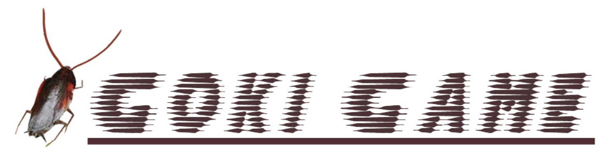
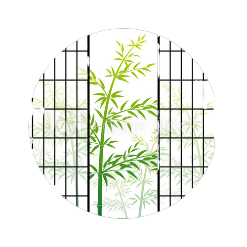
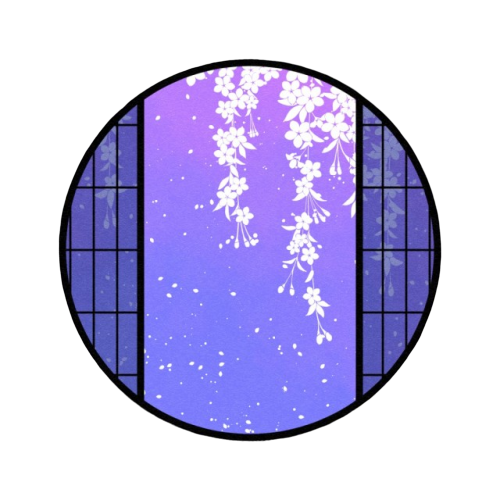
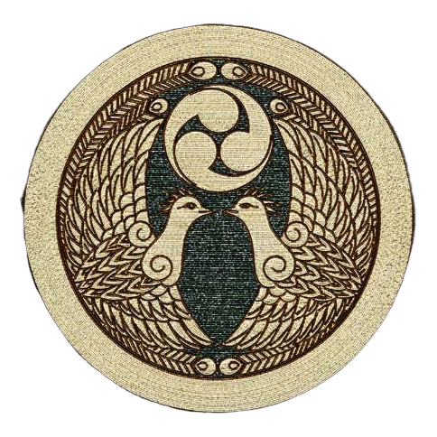

・Version:1.0
・Release:2020/2/23
・Environment:
&nbsp;&nbsp;&nbsp;&nbsp;&nbsp;&nbsp;Ruby 2.5.3
&nbsp;&nbsp;&nbsp;&nbsp;&nbsp;&nbsp;Rails 5.2.2
&nbsp;&nbsp;&nbsp;&nbsp;&nbsp;&nbsp;Docker 19.03.5
&nbsp;&nbsp;&nbsp;&nbsp;&nbsp;&nbsp;Heroku 7.38.1 linux-x64 node-v12.13.0
・Licence:
&nbsp;&nbsp;&nbsp;&nbsp;&nbsp;&nbsp;Created by GokiGokiMan!

 
 

## ゲームの概要

これはゴキブリをカーソルで操作し、襲いかかるゴキジェットを何個かわせたかのスコアを競うエクストリームアクションゲームです。このアプリはrails on dockerで作られており、またheroku上に構築されているためダウンロード及びインストール不要で下記URLから誰でも無料で楽しめます。

Link: [gokiapp.herokuapp.com](http://gokiapp.herokuapp.com)
※sign upのemailは適当で大丈夫です。
※テスト用アカウント
&nbsp;&nbsp;&nbsp;&nbsp;email: aaa@gmail.com
&nbsp;&nbsp;&nbsp;&nbsp;password: gokigoki

 
 

## 簡単な遊び方

やることは至ってシンプルな以下の２つです。
* ゴキブリを選択しゲームを始める
* カーソルでゴキブリを動かしゴキジェットを回避してスコアを稼ぐ

このスコアを用いて、ユーザーランキングにて他のプレイヤーと競うことができます。また、ただ回避するだけでなく、"shift", "1", "2"のキーにて「動き」をすることができ、これをするとスコアが加算されます。

このスコアはゲーム終了後、Goldに変換され、
「ゴキブリの復活」「ゴキブリの追加/編集」「動きの強化」
などの用途に使われます。

### ボタンの説明

|||||
|:-:|:-:|:-:|:-:|
|背景画像をトグルします|メイン画面へ遷移します|ログアウトします|ランキングページを表示します|
||||
|ショップのページを表示します|ゴキブリを追加します|ゴキブリを削除します|

 
 
 

## 使用した技術/サービス

#### メイン技術/サービス
* Ruby On Rails
* mysql
* Docker
* Heroku
* GitHub

#### 追加したGem
* devise
* gon
* pry

#### javascriptライブラリ
* jquery
* swiper.js
* anime.js

 
 

## その他このアプリについて
このアプリはRailsで私の作った初めてのアプリで、アルバイト及び企業インターンのためのポートフォリオの一部になっております。ネットからの画像を利用するなど、著作権周りで少し問題があるかもしれませんが、面接で使用後すぐに公開を停止します。